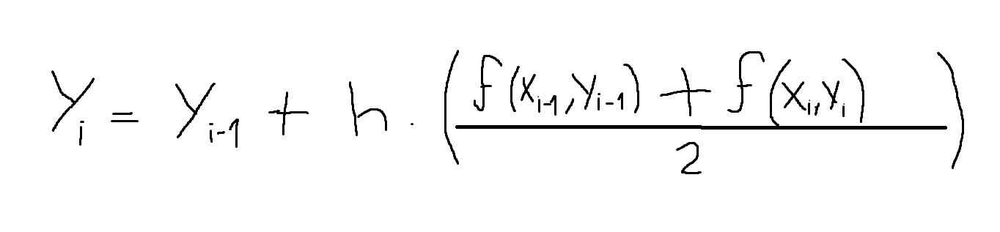

# Euler mejorado
## Explicación
Habiendo ya visto el método de euler, podemos mejorarlo a partir de la segunda iteración, obteniendo una pendiente más precisa al hacer un promedio entre la pendiente de la curva entre los puntos Xi y Xi-1:

Esta pendiente nos dara puntos con menor error aproximado respecto a los puntos del método de euler tradicional.