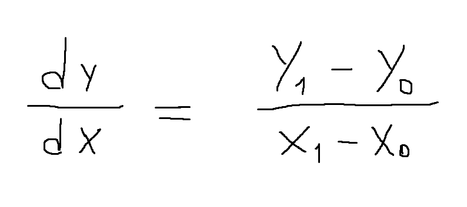
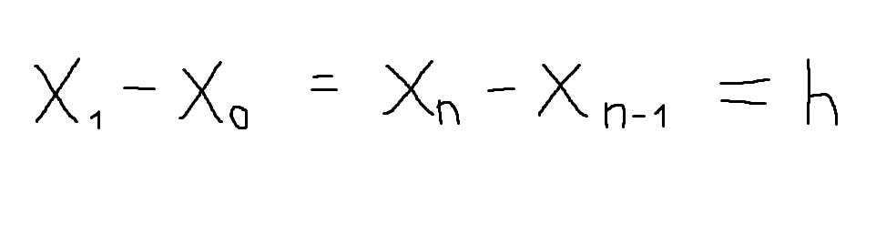

# Método de Euler

## Explicación

### Valores iniciales necesarios
* Funcion y' = f(x,y): Es la ecuacion diferencial en cuestion. Cada valor que nos devuelva en puntos especificos Xn e Yn, es la pendiente de una recta en esos puntos.

    Puede Tener otras notaciones:
    

* Valores iniciales x0, y0.

* Valor de h: distancia entre cada valor de x.

### Formula general y deducción
En la fórmula de la derivada, despejamos Y1.

Reemplazamos dy/dx por una de las otras notaciones, en este caso por f(X0, Y0).

Tambien reemplazamos X1 - X0 por h, que es la distancia que tendremos siempre, ya que usaremos valores de x equidistantes.

Nos queda la fórmula general:

## Instrucciones del programa
### Parquetes utilizados
* **Numpy**: Utilizado para manejar arrays grandes utilizando poca memoria. Puede hacer un poco mas dificil de leer el programa, pero se utiliza por recursos.
* **Pandas**: Para mostrar en formato de tablas los resultados.
* **Matplotlib**: Para mostrar la funcion y los resultados en un grafico.

Asegurense de crearse un entorno virtual con todos estos paquetes, o en todo caso tenerlos instalados globalmente.