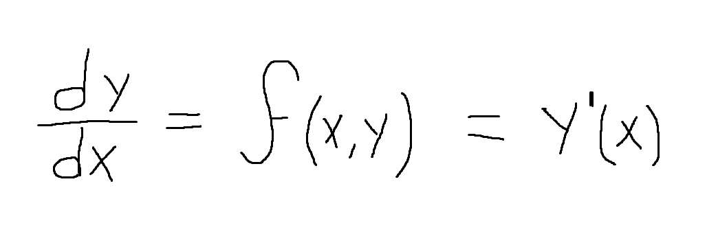
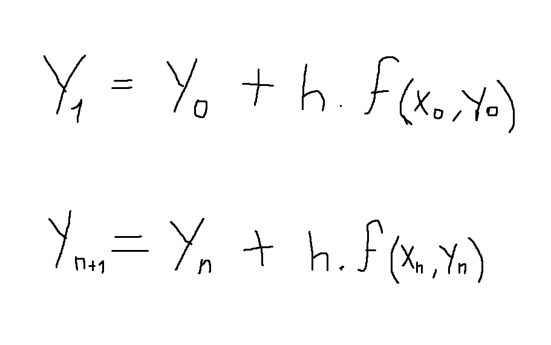

# Método de Euler

## Explicación

### Valores iniciales necesarios
* Funcion y' = f(x,y): Es la ecuacion diferencial en cuestion. Cada valor que nos devuelva en puntos especificos Xn e Yn, es la pendiente de una recta en esos puntos.

Puede Tener otras notaciones:

* Valores iniciales x0, y0.

* Valor de h: distancia entre cada valor de x.

### Formula general y deducción
En la fórmula de la derivada, despejamos Y1.

Reemplazamos dy/dx por una de las otras notaciones, en este caso por f(X0, Y0).

Tambien reemplazamos X1 - X0 por h, que es la distancia que tendremos siempre, ya que usaremos valores de x equidistantes.

Nos queda la fórmula general:

A partir de esta formula, obtendremos puntos **y** que pasan por la recta tangente a la ecuación buscada, con pendiente y' o f(Xn,Yn) como se ve en la imagen.

Estos puntos son aproximados a los de la ecuación **y** buscada. El error aproximado será menor en cada punto mientras mas chico sea el valor de **h**.