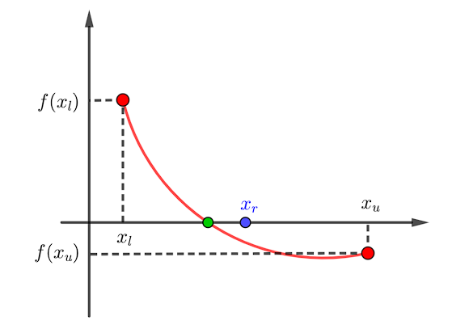

# Método de Bisección

## Explicación

Para una función, tomamos 2 valores de x iniciales en los que, al evaluar la función en ellos, esta nos devuelve valores de distinto signo.

Si la función es continua, el dato anterior nos indica que la raíz de la función está en un valor de x entre los 2 iniciales.

El método consiste en ubicar el valor medio entre estos 2 iniciales, evaluar la función en él, y reemplazar con él el valor inicial que devuelve un valor con el mismo signo en la función.

De esta forma, iteramos hasta obtener cierto error aproximado deseado.